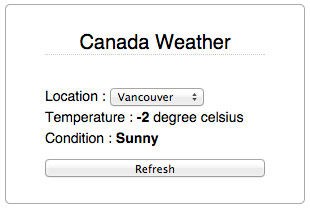

# Retrieving weather rss and display
===

### How to play?

1. got to <http://hirokazunakajima.com/retrieve-weather-rss/>
2. pick whichever location you want to know current weather
3. __Temperature__ and __Condition__ will be updating automatically
4. if you want to reload weather, just push __Refresh__ button

### What is it working in behind?

1. when you change location or press refresh, ajax will be run
2. script will go and grab data from __Yahoo weather RSS__ through the `dynamic_proxy.php` asynchronously
3. `dynamic_proxy.php` will return XML type data
4. find temperature and condtion attribute from response and grab data 
5. display(swap) data